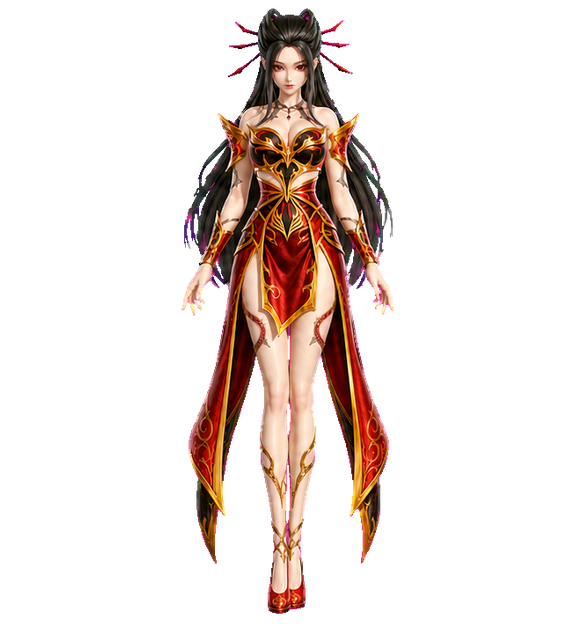
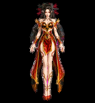
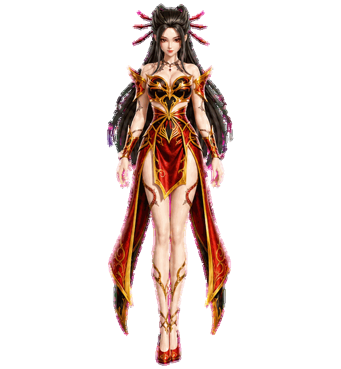
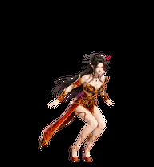

# Flame Spirit — Codex Pet

一个适用于 Codex 桌面端的自定义动态宠物，采用红、黑、金配色与火焰主题造型。



## 功能

- Codex v2 宠物格式
- 8 × 11 动画图集
- 9 种标准动画状态
- 16 个环视方向
- WebP 透明背景图集

## 安装

### macOS / Linux

克隆仓库后执行：

```bash
mkdir -p "${CODEX_HOME:-$HOME/.codex}/pets/flame-spirit"
cp pet.json spritesheet.webp "${CODEX_HOME:-$HOME/.codex}/pets/flame-spirit/"
```

然后重新打开 Codex 的宠物选择菜单，选择 **Flame Spirit**。

### 手动安装

将 `pet.json` 和 `spritesheet.webp` 放到：

```text
${CODEX_HOME:-$HOME/.codex}/pets/flame-spirit/
```

目录结构应为：

```text
flame-spirit/
├── pet.json
└── spritesheet.webp
```

## 动画预览

| Idle | Running | Waving | Jumping |
| --- | --- | --- | --- |
|  |  |  |  |

完整图集和方向检查图位于 [`qa/`](qa/) 目录。

> README 中的展示动画由制作过程中的高清动作源生成；实际安装文件仍遵循 Codex v2 的 `192 × 208` 单帧规格。

## 兼容性

本项目使用 `spriteVersionNumber: 2`，单帧尺寸为 192 × 208，完整图集尺寸为 1536 × 2288。显示清晰度受当前 Codex 宠物渲染规格限制。

## 免责声明

本项目为个人学习、技术研究与非商业用途项目，仅用于探索 Codex 动态终端宠物素材的制作、打包与安装流程。

“焰灵姬”相关形象、名称、梗图或动画灵感来源于网络流行内容，本项目并非官方项目，也未与相关原作者、权利方或平台存在任何商业合作、授权关系或背书关系。若你不了解“焰灵姬”的来源，可自行搜索相关公开资料。

本项目不出售、不收费、不用于商业推广，也不主张对原始角色形象、表情包、GIF 或相关衍生内容拥有版权。仓库中生成的 `spritesheet.webp` 仅作为 Codex 宠物效果预览与个人使用示例。

如果本项目中的任何素材、名称、描述或衍生内容侵犯了你的合法权益，请通过 Issue 或仓库联系方式告知，我会尽快处理，包括但不限于修改说明、替换素材或删除相关内容。

## 授权说明

本仓库暂不附带开源许可证。除法律明确允许的情形外，仓库公开可见不代表授予复制、修改、再发布或商业使用权。
